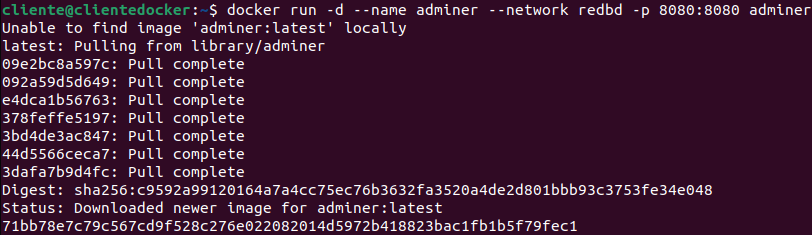
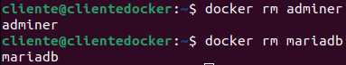

# Ejercicio 3 - Contenedores de Red

> Hecho por: Álvaro Fernández 
> Fecha de creación: 19 de Febrero de 2024 - 10:21

[TOC]

------

#### Enunciado

1. Crea una red bridge redbd
2. Crea un contenedor con una imagen de mariaDB que estará en la red redbd . Este contenedor se
    ejecutará en segundo plano, y será accesible a través del puerto 3306. (Es necesario definir la
    contraseña del usuario root y un volumen de datos persistente)
3. Crear un contenedor con Adminer que se pueda conectar al contenedor de la BD
4. Comprobar que el contenedor Adminer puede conectar con el contenedor mysql abriendo un
    navegador web y accediendo a la URL: http://localhost:8080

------

#### Proceso

- (1)

```bash
$ docker network create --driver bridge redbd
```


- (2) - mariadb

```bash
$ docker run -d --name mariadb --network nombre_red -p 3306:3306 -e MYSQL_ROOT_PASSWORD=1234 -v mariadb_data:/var/lib/mysql mariadb
```


- (3) - adminer

```bash
$ docker run -d --name adminer --network nombre_red -p 8080:8080 adminer
```




- (4)

  


------

#### Capturas de Pantalla

- Captura de pantalla y documento donde se vean los contenedores creados y en ejecución

  ```bash
  $ docker ps
  ```

  

  

- Captura de pantalla y documento donde se vea el acceso a la BD a través de la interfaz web de Adminer 

  

  

- Captura de pantalla y documento donde se vea la creación de una BD con la interfaz web Adminer

  

  

  

- Captura de pantalla y documento donde se entre a la consola del servidor web en modo texto y se compruebe que se ha creado la BD

  ```bash
  $ docker exec -it mariadb /bin/bash
  # mariabd -u root -p
  ```

  ```php
  > show databases;
  ```

  

  

- Borrar los contenedores la red y los volúmenes utilizados

  ```bash
  $ docker rm adminer
  $ docker rm mariadb
  ```

  