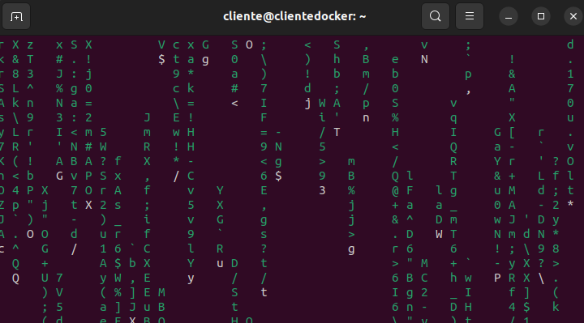

# Ejercicio 4 - Docker Compose

> Hecho por: Álvaro Fernández 
> Fecha de creación: 19 de Febrero de 2024 - 10:27

[TOC]

------

#### Enunciado

- Desplegar la aplicación cmatrix utilizando docker-compose.

------

#### Proceso

- (1)

```bash
$ nano docker-compose.yml
```


------

#### Capturas de Pantalla

- Captura de pantalla y documento donde se vea el fichero docker-compose.yaml.

  

  

- Captura de pantalla y documento donde se vea la aplicación funcionando. Se valorará conseguir el
  efecto Greenrain.

  ```bash
  $ cmatrix -C color
  ```

  

  

  

- Explicar brevemente cómo funciona esta aplicación.

  > Esta aplicación tiene la simple funcion de crear la lluvia de caracteres como se puede observar en la captura del apartado anterior. Por defecto el color de dichos caracteres es verde pero se puede cambiar a gusto del usuario. Para cambiar dicho efecto se le puede añadir el color deseado detrás del -C a la hora de ejecutar el comando del apartado anterior. 

