# Ejercicio 5 - Dockerfile

> Hecho por: Álvaro Fernández 
> Fecha de creación: 19 de Febrero de 2024 - 10:29

[TOC]

------

#### Enunciado

- Arranca un contenedor que ejecute una instancia de la imagen php:7.4-apache , que se llame web
  y que sea accesible desde un navegador en el puerto 8000.
- Coloca en el directorio raíz del servicio web ( /var/www/html ) un sitio web donde figure el nombre de los componentes del grupo - el sitio deberá tener al menos un archivo index.html y un archivo
  .css
- Coloca en ese mismo directorio raíz un archivo llamado mes.php que muestre el nombre del mes actual. Ver la salida del script en el navegador
- Borrar el contenedor
- Automatizar estas operaciones creando un fichero Dockerfile
- Subir la imagen a la cuenta de Docker Hub

------

#### Proceso

- Creación inicial del contenedor - documenta los pasos hasta el borrado del mismo

  - Arranca un contenedor que ejecute una instancia de la imagen php:7.4-apache , que se llame web
    y que sea accesible desde un navegador en el puerto 8000.

    ```bash
    $ docker run -d --name web -p 8000:80 php:7.4-apache
    ```

    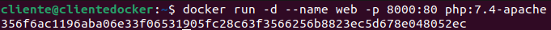

    

  - Coloca en el directorio raíz del servicio web ( /var/www/html ) un sitio web donde figure el nombre de los componentes del grupo - el sitio deberá tener al menos un archivo index.html y un archivo .css

    ```bash
    $ sudo mkdir -p /var/www/html
    ```

    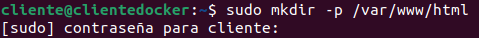

    

    ```bash
    $ sudo nano /var/www/html/index.html
    $ sudo nano /var/www/html/styles.css
    ```

    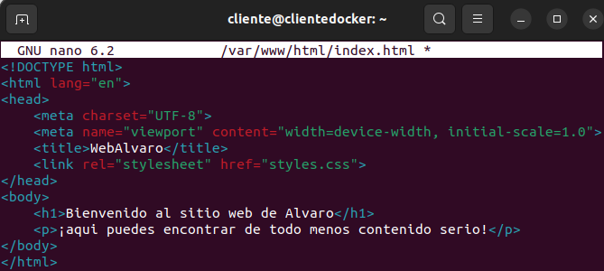

    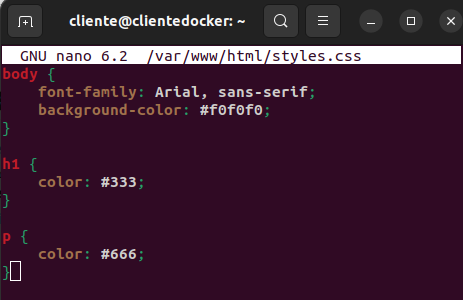

    

  - Coloca en ese mismo directorio raíz un archivo llamado mes.php que muestre el nombre del mes actual. 

    ```bash
    $ sudo nano /var/www/html/mes.php
    ```

    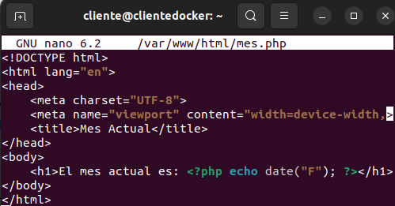

    

  - Ver la salida del script en el navegador

    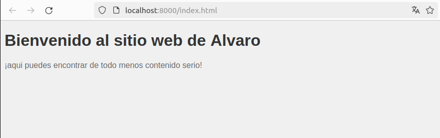

    

  - Borrar el contenedor

    ```bash
    $ docker ps
    $ docker stop web
    $ docker rm web
    ```

    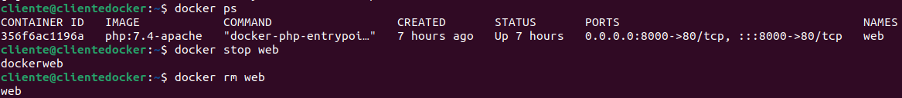


- Bloque de código con el Dockerfile
  - Automatizar estas operaciones creando un fichero Dockerfile

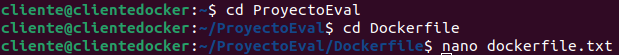

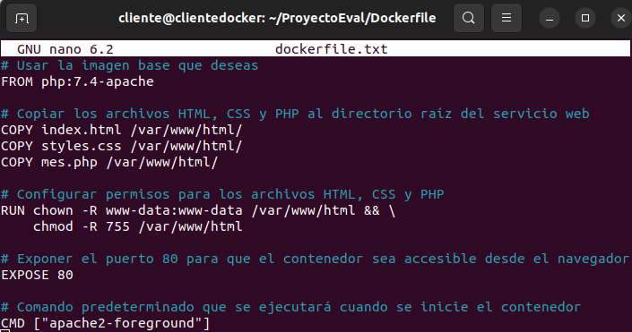


- Captura de pantalla y documento donde se vea el comando que crea la nueva imagen.

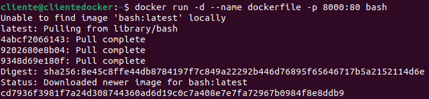


- Captura de pantalla y documento donde se vea la imagen subida a tu cuenta de Docker Hub. 
  - Subir la imagen a la cuenta de Docker Hub

> Se ha creado el repositorio "Dockerfile" desde Docker Hub el cual se encuentra vacio. No hay ninguna imagen por el momento. 

​	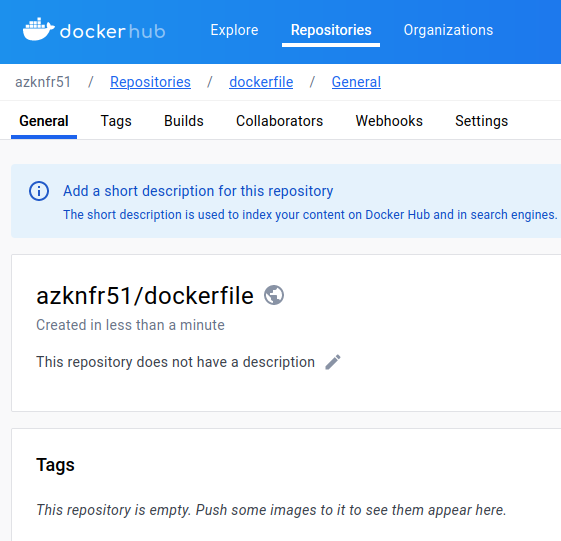


> Iniciamos sesión desde el terminal para vincular la cuenta con Docker Hub. 

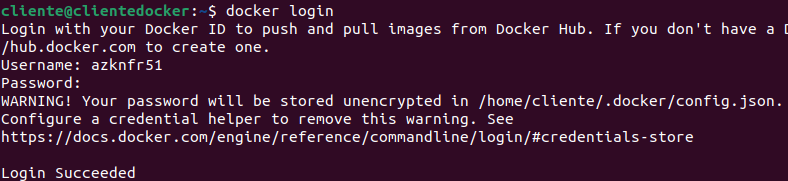

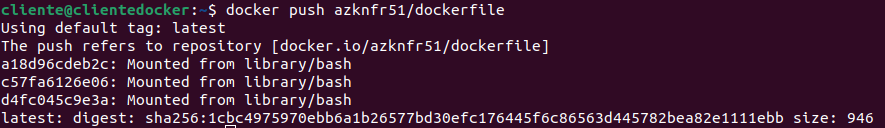


> Como se puede apreciar en la imagen de abajo, se ha añadido la imagen con la etiqueta latest. 

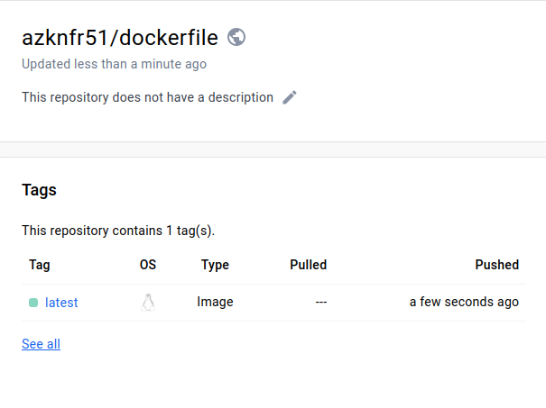

- Captura de pantalla y documento donde se vea la bajada de la imagen - por parte de otra persona del grupo - y la creación de un contenedor.
- Captura de pantalla y documento donde se ve el acceso al navegador con el sitio servido

